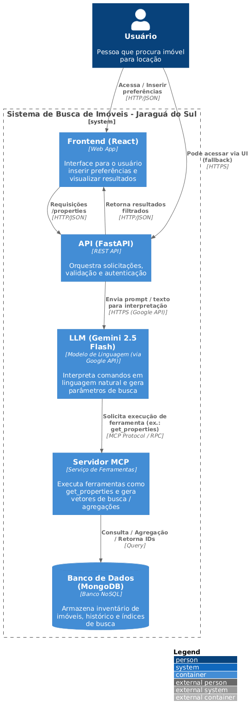

# 🏠 Aplicação de Modelos de Linguagem (LLMs) no desenvolvimento de um sistema de busca de apartamentos para aluguel em Jaraguá do Sul/SC

## 1. Descrição geral (objetivo e motivação)
Foi desenvolvido um sistema inteligente, baseado em Modelos de Linguagem de Grande Escala (LLMs), para a busca de imóveis disponíveis para locação no município de Jaraguá do Sul. O sistema terá como finalidade possibilitar a interação em linguagem natural, de modo que o usuário possa expressar suas necessidades habitacionais de forma simples e intuitiva, enquanto a inteligência artificial processa essas informações para realizar buscas mais precisas e personalizadas.

Ao longo dos últimos anos, o processo migratório para o município de Jaraguá do Sul tem apresentado crescimento significativo. De acordo com o Censo Demográfico do Instituto Brasileiro de Geografia e Estatística (IBGE, 2022), a cidade recebeu aproximadamente 40 mil migrantes entre 2010 e 2022. Esse cenário contribuiu não apenas para a expansão do número de imobiliárias na região, mas também para a elevação dos valores de aluguel. Um indicativo desse movimento foi apresentado pelo Conselho Regional de Corretores de Imóveis de Santa Catarina (CRECI-SC), que em 2025 registrou a existência de 171 imobiliárias ativas no município, incluindo algumas das mais conhecidas, como Itaivan, Seculus e Poder Imóveis.

Paralelamente, pesquisas de mercado apontam plataformas digitais como Zap Imóveis, Viva Real, Chave na Mão e Quinto Andar como recursos comumente utilizados para a busca de imóveis. Entretanto, o diferencial do presente projeto reside na proposta de oferecer ao usuário uma ferramenta capaz de retornar, de forma simplificada e com base em comandos de linguagem natural, opções de imóveis compatíveis tanto com o orçamento disponível quanto com a localização desejada.

Frente a isso, foi estruturado um projeto com LLM (Large Language Models).  Segundo Cunningham, Archambault e Kung (2024), ele é essencial não somente para reduzir custos, mas também para tornar a aplicação acessível e sustentável a longo prazo. Ele é um tipo de Inteligência Artificial (IA) que tem sido amplamente utilizada em pesquisas, aplicações open-source etc. Todos esses projetos podem ser tanto da área da saúde como a possibilidade de auxiliar um assistente médico sobre a literatura necessária para continuar atuando no seu cargo, conforme destacam Alberts et al. (2023), quanto na área de telecomunicações onde é apresentado um trabalho de Zhou et al. (2024, p. 2) onde é possível “os LLMs podem executar diversas tarefas downstream com base em instruções humanas, abrindo caminho para o 6G habilitado para inteligência geral artificial (AGI)”. Outro grande exemplo a favor dos estudantes de tecnologia é a possibilidade de ter um código compreendido, conforme as informações passadas dentro do LLM, um exemplo disso foi criado com o Nam et al. (2024). Esses e outros projetos podem ser encontrados em diversas bibliografias disponíveis.

O projeto consiste no desenvolvimento de um sistema voltado para a busca de imóveis disponíveis para locação no município de Jaraguá do Sul. A proposta baseia-se na utilização de um prompt, no qual o usuário insere informações em linguagem natural, permitindo o processamento, filtragem e posterior visualização dos imóveis disponíveis para aluguel. Ressalta-se que o escopo da pesquisa está restrito à cidade de Jaraguá do Sul, tendo como foco exclusivo o processo de locação e considerando inicialmente dados provenientes de uma imobiliária específica. Dessa forma, não contempla a análise de imóveis para compra, tampouco o contato direto entre o usuário e a imobiliária. Para esses casos, será disponibilizado um link de referência direcionando às informações originais.

A arquitetura da solução será estruturada como um sistema de múltiplos agentes de Inteligência Artificial, desenvolvidos em Python e implementados por meio da biblioteca CrewAI, em conjunto com o LangChain e um modelo da família Gemini, acessado via API da Google. O fluxo operacional será dividido em três etapas principais: (i) coleta e interpretação inicial das informações fornecidas pelo usuário; (ii) filtragem e organização dos dados conforme os critérios especificados; e (iii) retorno dos resultados processados ao usuário por meio de uma interface simplificada.

No que se refere ao tratamento de dados, as primeiras investigações contemplam a utilização de API pública disponibilizada no site da imobiliária. A estratégia prevê a extração periódica (diária) das rotas necessárias para atualização das informações, garantindo a manutenção de um banco de dados com registros válidos. Nesse processo, imóveis que não estiverem mais disponíveis para locação serão automaticamente removidos. Posteriormente, os dados atualizados serão consultados por meio de APIs e apresentados ao usuário via interface, em conformidade com os comandos inseridos. Todo o processo será conduzido por meio de modelos de linguagem natural (LLMs), de modo a viabilizar a interação em linguagem acessível ao usuário.


## 2. Motivação
- A solução foi desenvolvida para resolver o problema da classificação e busca inteligente de propriedades imobiliárias, motivada pela necessidade de incorporar modelos de linguagem (LLMs) capazes de interpretar preferências de usuários e realizar consultas semânticas de forma autônoma e contextualizada.
- É combinado  múltiplos agentes de IA (CrewAI + LangChain + Gemini) para interpretar linguagem natural, estruturar consultas e retornar imóveis compatíveis com os critérios fornecidos. O uso do servidor MCP permite modularidade e flexibilidade, enquanto a API centraliza a orquestração do fluxo de dados.

## 3. Arquitetura
A aplicação adota uma arquitetura baseada no Modelo C4, composta pelos seguintes elementos:

- Front-end: React
- Back-end: FastAPI
- Banco de Dados: MongoDB
- IA: LLM + servidor MCP
- Comunicação: HTTP/JSON

## 4. Como rodar o projeto (passo a passo)
#### Pré-requisitos: 
- Node.js
- Python 3.10+
- MongoDB
- Pip ou uv
- Chaves de API (OpenAI, HuggingFace, etc.)

#### Instruções
- Front-end
```
cd front-end
npm install
npm run dev
```
- Backend
```
cd rest_api
pip install -r requirements.txt
uvicorn app.main:app --reload
```

- Variáveis de ambiente

```
Criar um arquivo .env com:
ALLOW_ORIGIN="http://localhost:1234"
MONGO_URI="example_public_mongo_uri"
GOOGLE_API_KEY="example_public_google_api_key"
```

## 5. Implementação
- Render - backend: https://tcc-hx03.onrender.com
- Vercel - frontend: https://tcc-indol-tau.vercel.app/

## 6. Requisitos de Software
#### Requisitos Funcionais(RF): 
```
1. RF001 – O sistema deve permitir que o usuário realize a busca por imóveis utilizando linguagem natural.
2. RF002 – O sistema deve disponibilizar uma interface de navegação que exiba os resultados conforme os critérios solicitados.
3. RF003 – O sistema deve possibilitar que o usuário entre em contato com a imobiliária responsável pelo imóvel, mediante redirecionamento para o número ou canal de contato.
4. RF004 – O sistema deve permitir múltiplas interações, de modo que o usuário possa realizar quantas buscas considerar necessárias.
```
#### Requisitos Não-Funcionais (RNF):
```
1. RNF001 – O sistema deve retornar, no mínimo, um imóvel por consulta realizada.
2. RNF002 – O sistema deve utilizar um LLM de baixo custo operacional e de fácil manutenção (ex.: LLaMA 3 via Groq).
3. RNF003 – A interface deve ser simples, responsiva e acessível via navegador, permitindo a correta visualização das informações em diferentes tamanhos de tela.
```

## 7. BPMN (Descrição textual)
- Usuário → envia comando → Frontend
- Frontend → envia requisição → API FastAPI
- API → envia texto → LLM Gemini
- LLM → retorna parâmetros → Servidor MCP
- Servidor MCP → executa busca → Banco de Dados
- Banco → retorna resultados → MCP → API → Frontend

## 8. Diagrama de arquitetura
#### Nível 1 — Diagrama de Contexto

O sistema recebe comandos do usuário, interpreta via LLM Gemini, consulta o banco por meio do MCP e retorna resultados para o usuário.

#### Nível 2 — Diagrama de Containers

Frontend (React): interface
API (FastAPI): orquestra chamadas
LLM Gemini: interpretação semântica
Servidor MCP: execução de ferramentas
Banco de Dados: armazenamento e atualização diária

####  Nível 3 — Componentes

- Componente de Rotas: /properties
- Componente de Interpretação: agente LLM
- Componente de Busca: ferramenta get_properties
- Componente de Atualização: rotina diária da API

####  Nível 4 — Código

- api/routes/user_routes.py – rotas de usuário
- api/services/user_service.py – regras de negócio
- api/models/user_model.py – modelo de dados
- frontend/src/pages/Home.jsx – tela inicial
- frontend/src/services/api.js – comunicação com API


## 9. Vídeo da aplicação


## 10. Diagrama do funcionamento

